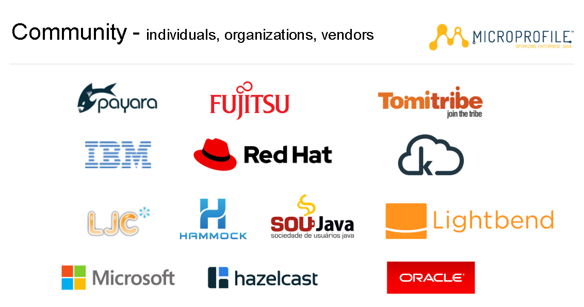
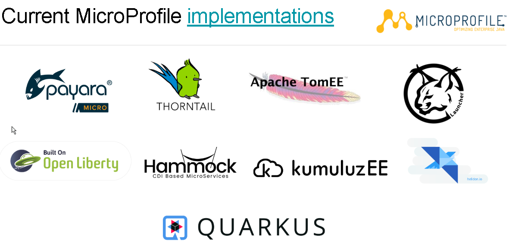
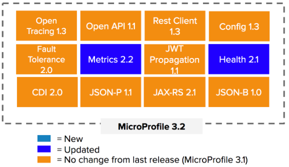
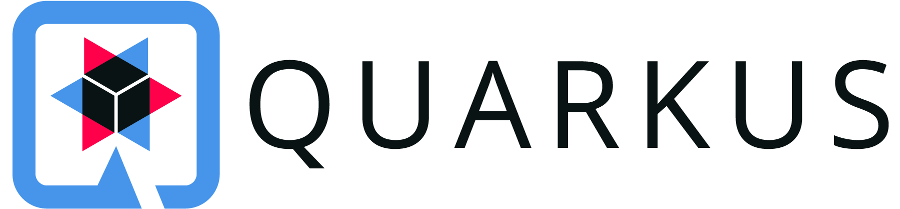
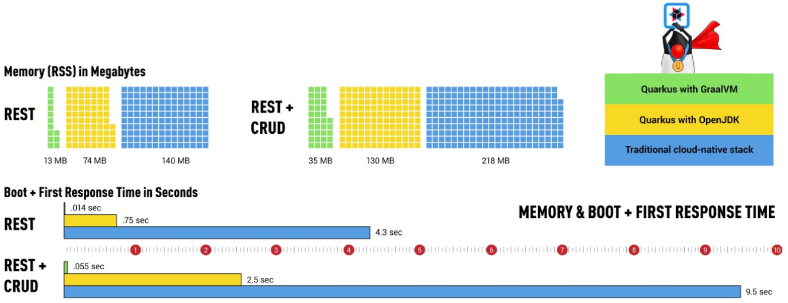
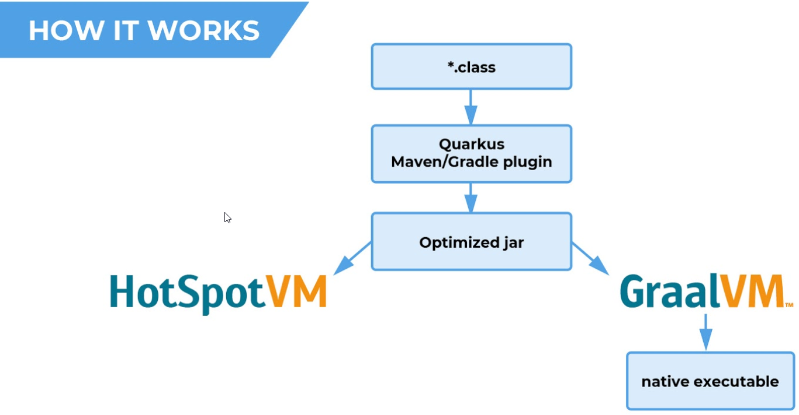
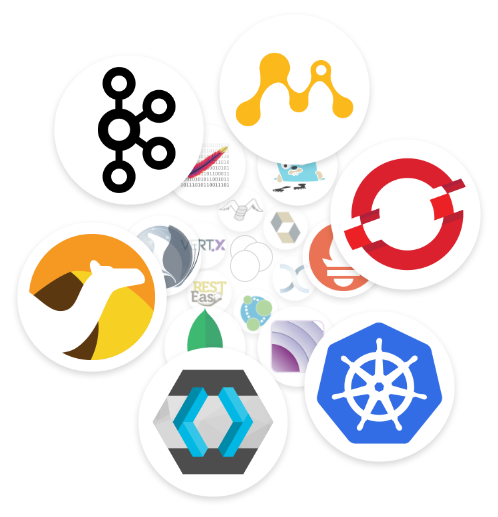

  

--

# Eclipse MicroProfile

--

## History

---

* Java EE 6 (2009)
  * Sun purchased  by Oracle (2010) {.fragment .fade-right}

* Java EE 7 (2013) {.fragment .fade-right}
  * AWS (2013) {.fragment .fade-right}
  * NodeJS (2013) {.fragment .fade-right}
  * Golang (2014) {.fragment .fade-right}
* Java EE 8 (2017) {.fragment .fade-right}
* Jakarta EE 8 ( 2019) {.fragment .fade-right}

---

* a reaction to the slow pace of Java EE development. 
  * 2016 Creation {.fragment .fade-right}
  * 2017 Eclipse foundation {.fragment .fade-right}
* new usages: {.fragment .fade-right}
  * microservice {.fragment .fade-right}
  * cloud native {.fragment .fade-right}
* an open-source community specification for Enterprise Java microservices {.fragment .fade-right}

<aside class="notes">
Java language plus populaire 
L'index TIOBE mesure la popularité des langages de programmation en se basant sur le nombre de pages web retournées par les principaux moteurs de recherche lorsqu'on leur soumet le nom du langage de programmation
Compétence présente, évolution JEE
</aside>

---

---

---

* new governance {.fragment .fade-right} 
* 12x the pace of traditional Java EE {.fragment .fade-right}
* with less risk and smaller feature sets, developers can adopt new innovations more quickly {.fragment .fade-right}

--

## Eclipse Microprofile 3.2 

---

* Released: 11/4/19 {.fragment .fade-right}
  * 3.1 -> 10/8/19 {.fragment .fade-right}
  * 3.0 -> 6/11/19 {.fragment .fade-right}
  * 2.0 -> 6/20/18 {.fragment .fade-right}

<aside class="notes">
3.3 2/2020
</aside>

---

 {.fragment .fade-right}

<aside class="notes">
Open tracing & Metrics & health: télémétrie des applications
OpenAPI: description des API
Rest Client: Client Rest
Config: hot reload configuration
Fault tolerance: tolérance à la panne
JWT propagation: OIDC
CDI: injection
JSON-P: Java API to process JSON
JAX-RS: Java API for rest
JSON-B: Binding from JSON to Object
</aside>

--

## 

Current version 1.2.10

--

### Microprofile implementation

---

Code: demo.cmd

---

### Overview

---

#### Developer joy
  * Simple {.fragment .fade-right}
  * Productivity {.fragment .fade-right} 

<aside class="notes">
Unified configuration
Zero config, live reload in the blink of an eye
Streamlined code for the 80% common usages, flexible for the 20%
No hassle native executable generation
</aside>

---

#### Performance

  * optimized libraries 

---

  * native packaging 

---

Compare : compare.cmd

---

#### Ecosystem

---

* Standard 
* Libraries

---

### Next

* Microprofile with Smallrye {.fragment .fade-right}
  * GraphQL {.fragment .fade-right}
  * Reactive Messaging {.fragment .fade-right}
  * Reactive Streams Operators {.fragment .fade-right}

<aside class="notes">
Open tracing & Metrics & health: télémétrie des applications
Reactive Messaging: Kafka  provides a way to inject streams into CDI beans
Reactive Streams Operators: reactive programming
</aside>

---

* [GraalVM 20.x](https://www.graalvm.org/docs/release-notes/20_0/)
  * Windows advanced support {.fragment .fade-right}
  * Performance {.fragment .fade-right}
  * Tooling (VSCode) {.fragment .fade-right}
  * Polyglot improvements {.fragment .fade-right}
  
---

* [Quarkus](https://github.com/orgs/quarkusio/projects/5)  
  * GraphQL {.fragment .fade-right}
  * Tooling (CLI, Gradle) {.fragment .fade-right}
  * Extensions (Redis, Liquibase) {.fragment .fade-right}

<aside class="notes">
Open tracing & Metrics & health: télémétrie des applications
Reactive Messaging: Kafka  provides a way to inject streams into CDI beans
Reactive Streams Operators: reactive programming
</aside>

---

--

## Conclusion

---

---

